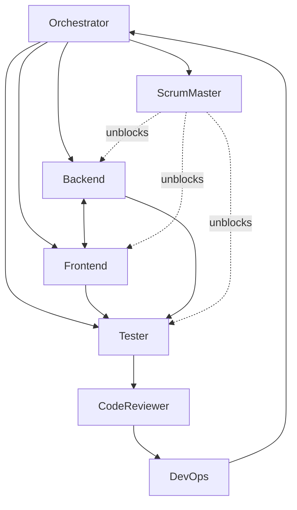

# Agent protocols

Shared message shapes the orchestrator uses to chain agents. Every inter-agent interaction in this repo should use one of these envelopes so context doesn't leak via informal prose.

## 1. Standup envelope

Collected by `scrum-master` (through `orchestrator`) at the start of each delegation cycle.

```json
{
  "agent": "backend-developer",
  "yesterday": ["shipped --page-numbers behind the @page margin box"],
  "today": ["thread --header-text through ConvertOptions"],
  "blockers": ["need CSS for the new .page-number-chip element"]
}
```

- Blockers listed here are routed immediately to the unblocking agent by scrum-master.
- Keep each field to 1-3 bullets. Standups are not status reports.

## 2. Parallel fan-out envelope

Used by the `orchestrator` when dispatching multiple implementers concurrently.

```json
{
  "task_id": "sprint-2026-04-18-page-numbers",
  "shared_context": "See .cursor/plans/sprint-2026-04-18.plan.md item #3. Goal: enable CSS @page margin box for page numbers behind --page-numbers.",
  "per_agent_prompt": [
    {
      "agent": "backend-developer",
      "prompt": "Thread --page-numbers through RawCliOptions -> ConvertOptions -> BuildHtmlOptions. Do not implement CSS."
    },
    {
      "agent": "frontend-developer",
      "prompt": "Implement the CSS @page margin box rendering page counter 'n / N' when BuildHtmlOptions.pageNumbers is true. Update buildPageChromeCss."
    },
    {
      "agent": "tester",
      "prompt": "Prepare samples/demo.md with --page-numbers. Verify via scripts/pdf-page1-to-png.js that the 14mm band appears at the bottom in both modes."
    }
  ],
  "rendezvous": "orchestrator merges handoffs and routes to code-reviewer when all three complete"
}
```

Dispatch ALL three agents in the same tool-call batch so they run concurrently. Wait for all handoffs before advancing.

## 3. Handoff envelope

Sent by an implementer when returning work to the orchestrator.

```json
{
  "from": "backend-developer",
  "to": "code-reviewer",
  "task_id": "sprint-2026-04-18-page-numbers",
  "artifact_paths": [
    "src/cli.ts",
    "src/converter.ts",
    "src/template.ts",
    "docs/cli-reference.md",
    "samples/out/demo.page1.light.png",
    "samples/out/demo.page1.dark.png"
  ],
  "checks_passed": ["typecheck", "build", "demo:light", "demo:dark", "verify-fullbleed"],
  "open_questions": ["Should --page-numbers auto-imply --header when neither is set?"],
  "summary": "Threads --page-numbers through the pipeline. 14mm @page margin box emitted. Docs updated. Light + dark PNGs attached."
}
```

- `checks_passed` is the green-list the code-reviewer will verify. Lying here is a rules violation and will be caught.
- `open_questions` are routed BACK through the orchestrator, not resolved unilaterally.

## 4. Review gate envelope

Returned by `code-reviewer` after running [review-a-pr.md](.cursor/instructions/review-a-pr.md).

```json
{
  "from": "code-reviewer",
  "pr_paths": ["src/cli.ts", "src/template.ts"],
  "task_id": "sprint-2026-04-18-page-numbers",
  "checklist_result": "changes_requested",
  "blocking_findings": [
    {
      "rule": "40",
      "file": "src/pdf.ts",
      "line": 112,
      "summary": "displayHeaderFooter was re-enabled. Rule 40 forbids this; running chrome must use @page margin boxes only."
    }
  ],
  "soft_suggestions": [
    "consider renaming BuildHtmlOptions.pageNumbers -> showPageNumbers for symmetry with showLinkUrls"
  ]
}
```

- `checklist_result` is one of `approved`, `changes_requested`, `blocked`.
- `blocked` signals a systemic issue that requires orchestrator intervention (e.g. a rule needs updating before the change can proceed).

## 5. Agent-to-agent query envelope

Used when one implementer needs a small answer from another without closing out their task.

```json
{
  "from": "frontend-developer",
  "to": "backend-developer",
  "question": "What HTML class does the new page-number element carry? I need the selector for buildPageChromeCss.",
  "context_paths": ["src/template.ts", ".cursor/plans/sprint-2026-04-18.plan.md#3"]
}
```

- Routed through the orchestrator in one round trip. No free-form back-and-forth.
- The answer returns as:

```json
{
  "from": "backend-developer",
  "to": "frontend-developer",
  "answer": "No new element. Use Chromium's built-in @page counter(page) / counter(pages). I'm not emitting an element."
}
```

## 6. Escalation envelope

Any agent to `orchestrator` -> `user` when a blocker requires out-of-scope decision.

```json
{
  "from": "devops",
  "to": "orchestrator",
  "severity": "blocker",
  "summary": "NPM_TOKEN expired; publish.yml failing. Need a rotated token to proceed with release v0.3.0.",
  "context_paths": [".github/workflows/publish.yml"],
  "suggested_action": "rotate and update repo secret"
}
```

- Severity is one of `info`, `warn`, `blocker`.
- Orchestrator escalates `blocker` to the user immediately. `warn` gets routed to scrum-master for next standup. `info` is logged in the sprint plan.

## 7. Plan artifact

Not an envelope per se, but the durable form of orchestrator output. Lives at `.cursor/plans/<slug>.plan.md`.

```md
---
name: <slug>
overview: <one sentence>
status: active | completed | cancelled
todos:
  - id: <id>
    content: <item>
    owner: <agent>
    status: pending | in_progress | completed
---

## Goal
## Committed
## DoD
## Handoffs observed
```

Implementer agents update their own todo `status` as they progress; orchestrator is the merge authority.

## Topology



- Orchestrator dispatches Backend + Frontend + Tester in one batch.
- Backend <-> Frontend talk via the agent-to-agent query protocol for shared contracts.
- All implementers hand off to Tester, who hands to CodeReviewer.
- DevOps is terminal (release). Scrum-master is lateral.
