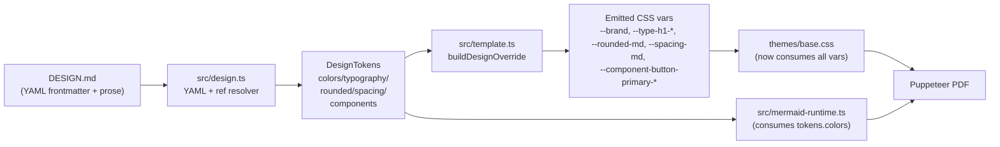

## Goal

Make `awesome-md-to-pdf` render PDFs from a DESIGN.md file exactly as its YAML frontmatter dictates, per [design.md/docs/spec.md](design.md/docs/spec.md). The current parser reads only prose "Color Palette & Roles" bullets and ignores the normative YAML entirely; the fix is a full replacement of the parsing and emission layer — not an additive tweak.

## The spec, distilled

From [design.md/docs/spec.md](design.md/docs/spec.md):

- Tokens live in **YAML frontmatter** (or fenced ```yaml blocks) between `---` delimiters. Prose is documentation, not a source of truth.
- Five token groups: `colors` (`map<string, hex>`), `typography` (`map<string, Typography>`), `rounded` (`map<string, Dimension>`), `spacing` (`map<string, Dimension | number>`), `components` (`map<string, map<string, value|{ref}>>`), plus `name` / `description` / `version`.
- Typography properties: `fontFamily`, `fontSize`, `fontWeight`, `lineHeight` (Dimension or unitless multiplier), `letterSpacing`, `fontFeature`, `fontVariation`.
- `{token.path}` reference syntax; primitives-only outside `components`, composite refs allowed inside `components`.
- Required section order (Overview → Colors → Typography → Layout → Elevation → Shapes → Components → Do's and Don'ts); unknown sections preserved; **duplicate `## Colors` must error**.

## What has to go

All prose-heuristic machinery is deprecated and deleted:

- [awesome-md-to-pdf/src/design.ts](awesome-md-to-pdf/src/design.ts): `SYNONYMS`, `SynonymRule`, `extractPalette`, `extractDarkPalette`, `extractContextPhrase`, `extractRolePhrase`, `extractDescriptionPhrase`, `resolveSlot`, `resolveAllSlots`, `isMultiRolePhrase`, `ROLE_FAMILIES`, `assignFromLines`, `matchFontLine`, `sliceSection`, `synthesizeDark`, `COLOR_RE`.
- All bundled fixtures in [awesome-md-to-pdf/samples/design-fixtures/](awesome-md-to-pdf/samples/design-fixtures/) (`apple.md`, `figma.md`, `nike.md`, `stripe.md`, `uber.md`, `vercel.md`) plus [awesome-md-to-pdf/samples/designs/linear.md](awesome-md-to-pdf/samples/designs/linear.md) and the baseline [awesome-md-to-pdf/src/designs/claude.md](awesome-md-to-pdf/src/designs/claude.md) are rewritten to YAML-frontmatter spec format.
- Docs that teach the prose format: [awesome-md-to-pdf/docs/designs.md](awesome-md-to-pdf/docs/designs.md), [awesome-md-to-pdf/src/designs/README.md](awesome-md-to-pdf/src/designs/README.md), [awesome-md-to-pdf/samples/design-fixtures/README.md](awesome-md-to-pdf/samples/design-fixtures/README.md), [awesome-md-to-pdf/.cursor/skills/design-system-knowledge/SKILL.md](awesome-md-to-pdf/.cursor/skills/design-system-knowledge/SKILL.md), [awesome-md-to-pdf/.cursor/instructions/add-or-update-design-token.md](awesome-md-to-pdf/.cursor/instructions/add-or-update-design-token.md).

## New token model

Rewrite `DesignTokens` in [awesome-md-to-pdf/src/design.ts](awesome-md-to-pdf/src/design.ts) to mirror the spec one-for-one:

```ts
export interface DesignTokens {
  version?: string;
  name: string;
  description?: string;
  source: string;
  colors: Record<string, string>;
  typography: Record<string, Typography>;
  rounded: Record<string, string>;
  spacing: Record<string, string | number>;
  components: Record<string, Record<string, string | number>>;
  sections: string[];
}
export interface Typography {
  fontFamily?: string;
  fontSize?: string;
  fontWeight?: number | string;
  lineHeight?: string | number;
  letterSpacing?: string;
  fontFeature?: string;
  fontVariation?: string;
}
```

`PaletteTokens` / `FontTokens` are deleted. Anything that consumed them ([awesome-md-to-pdf/src/template.ts](awesome-md-to-pdf/src/template.ts), [awesome-md-to-pdf/src/mermaid-runtime.ts](awesome-md-to-pdf/src/mermaid-runtime.ts), [awesome-md-to-pdf/src/repl.ts](awesome-md-to-pdf/src/repl.ts), [awesome-md-to-pdf/src/cli.ts](awesome-md-to-pdf/src/cli.ts)) switches to the new shape.

## New parser (`src/design.ts`)

Modeled on [design.md/packages/cli/src/linter/parser/handler.ts](design.md/packages/cli/src/linter/parser/handler.ts):

1. Read the file; run `gray-matter` (or hand-rolled `---`/`---` slice + `yaml` package) to extract frontmatter + body. Also scan the body for fenced ```yaml blocks and merge them (spec allows both).
2. Parse each YAML block with the `yaml` package. On YAML syntax error: throw a clean `DesignParseError` with line info.
3. Walk the body AST (via `markdown-it`, already a dep) to collect `## H2` headings, verify no duplicate `## Colors` / `## Typography` / etc. (error on duplicate, per spec).
4. Resolve `{token.path}` references: iterate until fixed point, detect cycles, error on unresolved/cyclic refs.
5. Validate: `Color` must match `#RRGGBB[AA]`; `Dimension` must end in `px|em|rem`; typography/spacing/components shapes validated per spec. Unknown component properties are accepted with a console warn (per spec's "Consumer Behavior" table).
6. Emit `DesignTokens`. No fallbacks, no synthesis.

Add `yaml` (or `js-yaml`) to [awesome-md-to-pdf/package.json](awesome-md-to-pdf/package.json) dependencies.

## Spec → CSS mapping (`src/template.ts` + `src/themes/tokens.css`)

Rewrite `buildDesignOverride` and `paletteToCss`. The Claude baseline in [awesome-md-to-pdf/src/themes/tokens.css](awesome-md-to-pdf/src/themes/tokens.css) is rewritten to mirror the spec's role vocabulary so YAML tokens drop straight in.

**Colors** — emit one CSS var per key, using the spec's role names. Map canonical names to the existing renderable roles:

- `primary` → `--brand`, also `--color-primary`
- `secondary` → `--color-secondary` (used for subtle surfaces / chips)
- `tertiary` → `--brand-soft`, `--color-tertiary`
- `neutral` → `--bg-page` (fallback) + `--color-neutral`
- `surface` → `--bg-surface`
- `on-surface` → `--text-primary`
- `on-surface-variant` → `--text-secondary`
- `outline` → `--border-soft`
- `outline-variant` → `--border-warm`
- `error` / `on-error` → `--error` / `--on-error`
- Any other key (`surface-container`, `primary-fixed`, …) is emitted verbatim as `--color-<key>` so components can reference it.

**Typography** — emit per-level custom properties and apply them to heading/body selectors:

```css
:root {
  --type-h1-family: ...; --type-h1-size: ...; --type-h1-weight: ...; --type-h1-line: ...; --type-h1-track: ...;
  --type-body-md-family: ...; ...
}
.markdown-body h1 { font-family: var(--type-h1-family, var(--type-headline-lg-family, var(--font-serif))); font-size: ...; ... }
```

Heading → token name lookup chain: `h1 → headline-xl → headline-lg → display-lg`, `h2 → headline-lg → headline-md`, … `p → body-md → body-lg`, `code → body-sm → label-md`. First-match-wins so any naming the spec author uses maps sensibly. Hardcoded pt values in [awesome-md-to-pdf/src/themes/base.css](awesome-md-to-pdf/src/themes/base.css) (h1 32pt, h2 24pt, etc.) are replaced with `var(--type-hN-*)` with `initial` or baseline fallbacks.

**Rounded** — emit `--rounded-<key>` for every key; rewrite existing `--radius-sm/md/lg/xl` selectors in [awesome-md-to-pdf/src/themes/base.css](awesome-md-to-pdf/src/themes/base.css) to consume `--rounded-sm/md/lg/xl`.

**Spacing** — emit `--spacing-<key>` for every key. Where a `base` / `md` unit exists, rewrite baked-in 8pt/12pt/16pt list/paragraph margins in [awesome-md-to-pdf/src/themes/base.css](awesome-md-to-pdf/src/themes/base.css) to `calc(var(--spacing-md, 16px) * N)`.

**Components** — resolve each component's `{token}` references, then emit a scoped class:

```css
.component-button-primary {
  background: var(--component-button-primary-bg);
  color: var(--component-button-primary-fg);
  border-radius: var(--component-button-primary-rounded);
  padding: var(--component-button-primary-padding);
  ...
}
```

Recognized component keys (`button-primary`, `button-secondary`, `chip`, `input-field`, `card`, `list-item`, `badge`, `tooltip`, `checkbox`, `radio`) are also aliased onto the markdown pipeline: add a small transform in [awesome-md-to-pdf/src/markdown.ts](awesome-md-to-pdf/src/markdown.ts) so a fenced `::: button-primary` container or a task-list checkbox receives the matching class. Unknown component keys emit vars but no implicit class (the consumer-warning path, per spec).

## Mermaid update

[awesome-md-to-pdf/src/mermaid-runtime.ts](awesome-md-to-pdf/src/mermaid-runtime.ts) `applyDesignToMermaid` is rewritten to pull from `design.colors` (primary/secondary/outline/surface/on-surface) and `design.typography['body-md']?.fontFamily` instead of the old `PaletteTokens`.

## `--accent` CLI flag

Kept; still wins over YAML. Overrides `--brand` and `--color-primary` only.

## Fixtures & baseline

Rewrite every bundled design to YAML-frontmatter spec form:

- [awesome-md-to-pdf/src/designs/claude.md](awesome-md-to-pdf/src/designs/claude.md) — the authoritative Claude baseline, now with full `colors` / `typography` / `rounded` / `spacing` / `components` sections matching the current CSS values. This is what loads when no `--design` is passed.
- [awesome-md-to-pdf/samples/design-fixtures/*.md](awesome-md-to-pdf/samples/design-fixtures/) — Apple, Figma, Linear, Nike, Stripe, Uber, Vercel rewritten as spec-compliant documents. Use [design.md/examples/totality-festival/DESIGN.md](design.md/examples/totality-festival/DESIGN.md) and [design.md/examples/paws-and-paths/DESIGN.md](design.md/examples/paws-and-paths/DESIGN.md) as the structural templates.
- Remove [awesome-md-to-pdf/samples/designs/linear.md](awesome-md-to-pdf/samples/designs/linear.md) (duplicate of the fixture).

## Verification harness

Rewrite [awesome-md-to-pdf/scripts/verify-design-parse.js](awesome-md-to-pdf/scripts/verify-design-parse.js):

- Parse every fixture + `claude.md` + [design.md/examples/*/DESIGN.md](design.md/examples/) (imported as extra fixtures, read-only).
- Assert `colors.primary` is a valid hex on every file.
- Assert `typography['body-md'].fontFamily` resolves.
- Assert `rounded.md` is a valid Dimension.
- Assert `{token.path}` refs inside any `components` block resolve.
- Assert a duplicate-`## Colors` fixture is rejected with the spec's error.
- Assert a YAML-syntax-error fixture is rejected cleanly.
- Add a visual-regression fixture: render [design.md/examples/totality-festival/DESIGN.md](design.md/examples/totality-festival/DESIGN.md) to PDF and diff the first page against a checked-in baseline PNG using the existing [awesome-md-to-pdf/scripts/pdf-page1-to-png.js](awesome-md-to-pdf/scripts/pdf-page1-to-png.js) script.

## Flow diagram



## Docs updates

- [awesome-md-to-pdf/docs/designs.md](awesome-md-to-pdf/docs/designs.md) — replace the "prose-friendly" section with "DESIGN.md follows Google's [spec](https://...design.md spec URL); bring your `---` frontmatter."
- [awesome-md-to-pdf/src/designs/README.md](awesome-md-to-pdf/src/designs/README.md) — one-page authoring guide keyed to spec section names.
- [awesome-md-to-pdf/.cursor/skills/design-system-knowledge/SKILL.md](awesome-md-to-pdf/.cursor/skills/design-system-knowledge/SKILL.md) — rewrite to describe the new parser, the token→CSS mapping table, and delete the old synonyms lore.
- [awesome-md-to-pdf/docs/changelog.md](awesome-md-to-pdf/docs/changelog.md) — log as **BREAKING**: DESIGN.md files without YAML frontmatter will no longer be parsed; migration guide link.
- [awesome-md-to-pdf/.cursor/instructions/add-or-update-design-token.md](awesome-md-to-pdf/.cursor/instructions/add-or-update-design-token.md) — rewrite to "add a token key to YAML + add the CSS mapping in template.ts".

## Risks & call-outs

- **Breaking change for external users.** Any DESIGN.md a user authored against the old prose format stops working. The plan drops a clear migration note in the changelog and a "v0.2.0-beta" version bump.
- **Mermaid theme depth.** Spec typography isn't one-to-one with mermaid variables; only `fontFamily` is passed through. Document the limitation.
- **Typography mapping heuristics.** The h1→`headline-xl` vs h1→`display-lg` lookup chain is a project-level convention; called out in docs so authors know what to name their levels.
- **Component-class application.** Only fires for a small allowlist of recognized component keys (button-primary, chip, input-field, etc.) plus containers/task-lists that already exist in the markdown pipeline — we're not inventing new markdown syntax.