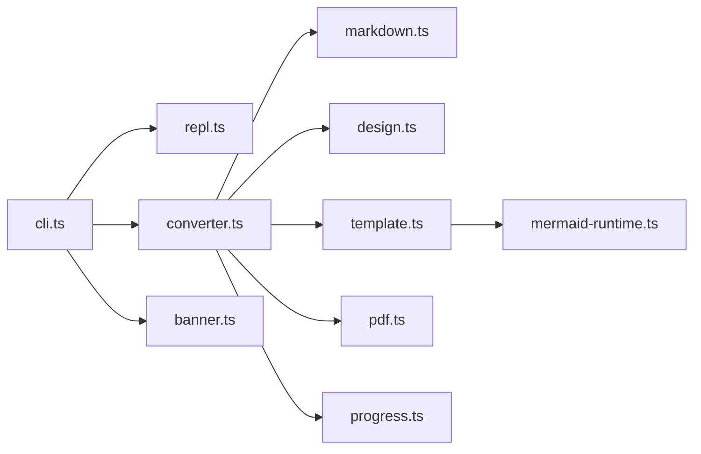

## 1. `.github/` — CI/CD automation

Three workflows plus Dependabot.

### `.github/workflows/ci.yml` — build + typecheck on push/PR
- Triggers: `push` to `main`, `pull_request` to `main`
- Matrix: Node 18 / 20 / 22 on `ubuntu-latest`, plus a single `windows-latest` Node 20 job (the app has Windows users)
- Steps: `actions/checkout@v4` -> `actions/setup-node@v4` (with `cache: npm`) -> `npm ci` -> `npm run typecheck` -> `npm run build` -> smoke test `node bin/awesome-md-to-pdf.js --help`
- Set `PUPPETEER_SKIP_DOWNLOAD=1` in env for speed (we're not running conversions in CI yet)

### `.github/workflows/publish.yml` — npm publish on GitHub Release
- Trigger: `release: { types: [published] }`
- Permissions: `contents: read`, `id-token: write` (for npm provenance)
- Steps: checkout -> `setup-node@v4` with `registry-url: https://registry.npmjs.org` and `cache: npm` -> `npm ci` -> assert `package.json` version matches `${{ github.event.release.tag_name }}` (strip leading `v`) -> `npm run build` -> `npm publish --provenance --access public`
- Secret required: `NPM_TOKEN`

### `.github/workflows/pages.yml` — deploy docs/ to GitHub Pages
- Triggers: `push` to `main` with `paths: ['docs/**', '.github/workflows/pages.yml']`, plus `workflow_dispatch`
- Permissions: `contents: read`, `pages: write`, `id-token: write`
- Concurrency: group `pages`, `cancel-in-progress: false`
- Build job: checkout -> `ruby/setup-ruby@v1` with `bundler-cache: true` and `working-directory: docs` -> `actions/configure-pages@v5` -> `jekyll build -s docs -d _site --baseurl "${{ steps.pages.outputs.base_path }}"` -> `actions/upload-pages-artifact@v3` with `path: _site`
- Deploy job: uses `actions/deploy-pages@v4`, depends on build

### `.github/dependabot.yml`
- `npm` directory `/` weekly, `github-actions` directory `/` weekly. Grouped minor/patch updates.

## 2. `package.json` + repo metadata prep for npm

Edit [package.json](package.json) to add:
- `"repository": { "type": "git", "url": "https://github.com/behl1anmol/awesome-md-to-pdf.git" }`
- `"bugs": { "url": "https://github.com/behl1anmol/awesome-md-to-pdf/issues" }`
- `"homepage": "https://behl1anmol.github.io/awesome-md-to-pdf"`
- `"publishConfig": { "access": "public", "provenance": true }`

Additional:
- Add `LICENSE` (MIT) at repo root — already listed in `files` but missing on disk
- Create `.github/CODEOWNERS` (optional) and `.github/PULL_REQUEST_TEMPLATE.md` (optional, light)
- Since `files` is already an allowlist, no `.npmignore` is needed

## 3. `docs/` — Just the Docs with 'parchment' color scheme

Remote-theme Jekyll (works on GitHub Pages natively). Custom color scheme that borrows tokens from [src/themes/tokens.css](src/themes/tokens.css) + [src/themes/base.css](src/themes/base.css):
- `$body-background-color: #F7F2EA` (parchment canvas)
- `$body-text-color: #1F1B16`
- `$link-color: #C85A3F` (terracotta brand accent)
- `$btn-primary-color: #C85A3F`
- `$sidebar-color: #EFE8DC`, `$body-heading-color: #1F1B16` with serif stack `'Iowan Old Style', Georgia, serif`
- Mono stack `'JetBrains Mono', ui-monospace, monospace`

### Tree

```text
docs/
  _config.yml
  Gemfile
  .gitignore                          # _site, Gemfile.lock for remote theme
  index.md                            # hero + install
  getting-started.md
  chat-mode.md
  one-shot-mode.md
  cli-reference.md
  designs.md                          # getdesign.md + custom DESIGN.md
  themes-and-modes.md                 # light/dark
  markdown-features.md
  architecture.md                     # mermaid module diagram of src/
  development.md
  troubleshooting.md
  changelog.md                        # stub, driven by GH Releases
  _sass/color_schemes/parchment.scss  # custom palette override
  assets/css/just-the-docs-custom.scss
  assets/images/                      # reuse samples/out-linear/*.png previews
```

### `_config.yml` (essentials)

```yaml
title: awesome-md-to-pdf
description: Awesome editorial Markdown → PDF, Claude-inspired.
remote_theme: just-the-docs/just-the-docs
color_scheme: parchment
search_enabled: true
heading_anchors: true
permalink: pretty
plugins:
  - jekyll-remote-theme
  - jekyll-seo-tag
  - jekyll-sitemap
aux_links:
  GitHub: https://github.com/behl1anmol/awesome-md-to-pdf
  npm:    https://www.npmjs.com/package/awesome-md-to-pdf
nav_external_links:
  - title: getdesign.md
    url:   https://getdesign.md
```

### `Gemfile`

```ruby
source "https://rubygems.org"
gem "jekyll", "~> 4.3"
gem "just-the-docs"
gem "jekyll-remote-theme"
gem "jekyll-seo-tag"
gem "jekyll-sitemap"
```

### Content mapping

- `index.md` — tagline + install snippet + screenshot of a rendered PDF page (reuse `samples/out-linear/demo-linear-light.page1.png` / `demo-linear-dark.page1.png`)
- `getting-started.md` — node version, `npm i -g awesome-md-to-pdf`, first run, first PDF
- `chat-mode.md` — REPL navigation keys + slash command table (ported from README)
- `one-shot-mode.md` — CLI usage examples
- `cli-reference.md` — full flag table (ported from README)
- `designs.md` — how the `DESIGN.md` parser works (links to [src/design.ts](src/design.ts)), using getdesign.md, bundled Claude baseline
- `themes-and-modes.md` — light vs dark, accent override
- `markdown-features.md` — everything markdown-it exposes (same list as README)
- `architecture.md` — high-level module diagram:



- `development.md` — `npm run build|typecheck|clean|demo:light|demo:dark`, project layout
- `troubleshooting.md` — Puppeteer/proxy, fonts, banner, progress bar caveats (ported from README)

### Preview / dogfooding callout
On `index.md` include a generated-with-ourself PDF download link once the publish pipeline runs once (link to release assets — future-proof).

## 4. README touch-ups

After docs land, update the Install section of [README.md](README.md) to show `npm i -g awesome-md-to-pdf` and link to `https://behl1anmol.github.io/awesome-md-to-pdf`. Keep the current content intact.

## Placeholders to confirm at implementation time

- GitHub owner/org for `homepage`, `repository`, `aux_links`, and the Pages `baseurl`. If unspecified I'll use `behl1anmol` tokens and flag them in a one-line TODO at the top of `_config.yml` and `package.json`.
- npm package name stays `awesome-md-to-pdf` (matches `package.json`).
