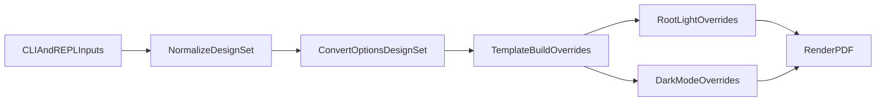

# Dual DESIGN.md Architecture

## Decision
Adopt **mode-specific design tokens** as the long-term model:
- `DESIGN.md` is source of truth for visual tokens.
- Light and dark each can point to separate design files.
- Built-in Claude defaults remain available for both modes.

## Why this fits your goals
- Keeps the model simple and unambiguous: one design source per mode.
- Keeps current `--mode` UX intact (no abrupt mental-model break).
- Improves maintainability by removing parallel legacy code paths.

## Current-state findings
- CLI/REPL already carry `mode` and a single `design` token set through conversion.
- The CSS stack still has baked dark fallback tokens in `[data-mode="dark"]` in [`/mnt/stuff/WebstormProjects/awesome-md-to-pdf/src/themes/tokens.css`](/mnt/stuff/WebstormProjects/awesome-md-to-pdf/src/themes/tokens.css).
- `buildDesignOverride` currently emits only one `:root` block from one design object in [`/mnt/stuff/WebstormProjects/awesome-md-to-pdf/src/template.ts`](/mnt/stuff/WebstormProjects/awesome-md-to-pdf/src/template.ts).
- REPL supports `/mode` and `/design`, but not per-mode design routing in [`/mnt/stuff/WebstormProjects/awesome-md-to-pdf/src/repl.ts`](/mnt/stuff/WebstormProjects/awesome-md-to-pdf/src/repl.ts).

## Target architecture
- Introduce a **DesignSet** model in options/session:
  - `designLight: DesignTokens | null`
  - `designDark: DesignTokens | null`
- Mode selection chooses which design is active at render time.
- Breaking change:
  - Remove `--design` and single-design propagation.
  - Require explicit mode-scoped design assignment when custom designs are used.

## Precedence contract
Per active mode, apply in this order:
1. Built-in mode baseline (Claude light/dark tokens in theme CSS).
2. Mode-specific DESIGN.md overrides (`light` design for light mode, `dark` design for dark mode).
3. `--accent` override (still narrow: brand vars only).

## CLI and REPL surface
- Remove old flag in CLI:
  - `--design <path>`
- Add required explicit flags in CLI:
  - `--design-light <path>`
  - `--design-dark <path>`
- REPL commands become mode-scoped:
  - `/design light <path>` and `/design dark <path>`
  - `/design reset light|dark|all`
  - `/design info light|dark|all`
  - `/status` shows light and dark design sources independently.

## Template/CSS integration
- Update template emitter to accept both designs and emit mode-scoped overrides:
  - `:root { ...lightVars }`
  - `[data-mode="dark"] { ...darkVars }`
- If only one mode-specific design exists, only emit that block and let the other mode fall back to Claude defaults.
- Keep `[data-mode="dark"]` token fallback block in theme CSS as safety net.

## Docs and migration
- Document recommended usage as two explicit design files.
- Document `--design` removal as a breaking change.
- Add migration examples from single-design to dual-design commands/flags.

## Verification strategy
- Parser coverage: verify both mode-specific files load and errors are isolated to the failing mode/path.
- Rendering smoke tests:
  - no design passed (Claude light + dark baseline)
  - only `--design-light`
  - only `--design-dark`
  - both mode-specific flags
- CLI negative test: `--design` must fail with a clear migration hint.
- REPL checks for `/mode` switching and per-mode design application.

## Implementation flow

