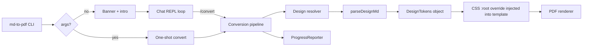

## Goal

Two orthogonal features shipped together:

1. **Dynamic design pipeline** — point the tool at any `DESIGN.md` file and it produces a PDF styled in that design system. The bundled Claude DESIGN.md remains the default so every existing call keeps working pixel-identically.
2. **Conversational CLI** — when launched with no arguments, show a custom banner and drop into a claude-code-style chat REPL driven by slash commands, with live progress bars for conversions.

## High-level architecture



## 1. Heuristic DESIGN.md parser — new [src/design.ts](src/design.ts)

Responsibility: take a path to a `DESIGN.md` (or a folder containing one) and return a `DesignTokens` object. Never throws; anything not recognizable falls through to the Claude baseline.

### Token shape

```ts
export interface DesignTokens {
  name: string;              // "Claude", "Linear", etc.
  source: string;            // original file path
  light: PaletteTokens;
  dark: PaletteTokens;
  fonts: { serif?: string; sans?: string; mono?: string };
}

interface PaletteTokens {
  bgPage?: string; bgSurface?: string; bgSand?: string;
  textPrimary?: string; textSecondary?: string; textTertiary?: string;
  brand?: string; brandSoft?: string;
  borderSoft?: string; borderWarm?: string;
  codeBg?: string; codeBorder?: string; codeInlineBg?: string;
  error?: string; focus?: string;
}
```

### Extraction strategy (deterministic, regex-only)

Verified against 5 real DESIGN.md files on getdesign.md (Claude, Linear, Stripe, Vercel, WIRED). Key findings:

- **"Color Palette & Roles" section is ALWAYS present** with the same subsection names: Primary, Secondary & Accent, Surface & Background, Neutrals & Text, Semantic & Accent.
- **"Quick Color Reference" section is OPTIONAL** -- Claude and Vercel have it; WIRED does not. Parser must degrade gracefully.
- **Color formats** seen in the wild: `#rgb`, `#rrggbb`, `#rrggbbaa`, `rgb(...)`, `rgba(...)`, `hsl(...)`, `hsla(...)`. All must be accepted by the color regex.
- **Role-name phrasing varies a lot** per brand (Claude's "Terracotta Brand" vs Vercel's "Ship Red" vs WIRED's "Page Ink"). The synonym table uses case-insensitive substring/word matching rather than exact strings.
- **Bold-vs-plain names**: Claude bolds role names (`**Terracotta Brand** (#c96442):`), Vercel does not (`Vercel Black (#171717):`). Regex must accept both.

Walk the markdown and extract in this priority order (first match wins per token slot):

1. **"Quick Color Reference" block** (in section 9 when present). Pattern: `Role: Name (color)` -> cleanest source. Used when available.
2. **"Color Palette & Roles" bullets** (section 2). Pattern: `(?:\*\*)?Name(?:\*\*)?\s*\(color\)\s*:` -> map role-name text through a synonym dictionary.
3. **Typography Font Family block** (section 3). Lines: `Headline: ``X`` ... fallback: ``Y``` or `Primary: X, with fallbacks: Y, Z` -> `fonts.serif = "X, Y, Z"`.
4. **Inline color sweep** across the doc as a last-ditch palette harvest for any role keywords found within ~60 chars of a color literal.

Unified color regex (all formats):

```ts
const COLOR_RE = /(#[0-9a-f]{3,8}|rgba?\([^)]+\)|hsla?\([^)]+\))/gi;
```

Role -> token synonym table (case-insensitive, substring-based, richer after observing real files):

- `parchment | paper | canvas | page background | newsprint | background` -> `bgPage`
- `ivory | card | surface | elevated | container | panel` -> `bgSurface`
- `sand | chip | warm sand | subtle bg` -> `bgSand`
- `near black | vercel black | page ink | primary text | heading text | headline | body text` -> `textPrimary`
- `olive | secondary text | muted text | body gray` -> `textSecondary`
- `stone | tertiary | metadata | caption | disabled | footnote` -> `textTertiary`
- `brand | terracotta | primary cta | accent | link blue | link | ship red | ship` -> `brand`
- `coral | brand soft | secondary brand | hover` -> `brandSoft`
- `border cream | border soft | subtle border | hairline tint | hairline border` -> `borderSoft`
- `border warm | prominent border | section divider | divider` -> `borderWarm`
- `error | crimson | danger | red` (only when NOT in "brand" context) -> `error`
- `focus | focus ring` -> `focus`

Disambiguation order matters: we test `brand` synonyms before `error` to avoid Vercel's "Ship Red" or "Preview Pink" being misread as error. First-match-wins within the ordered list.

### Dark-mode derivation

Two cases:

- If the DESIGN.md mentions explicit dark tokens ("Dark Surface (#30302e)", "Near Black (#141413) dark-theme page background"), those populate `dark`.
- Otherwise, synthesize `dark` via a small inverter: swap `bgPage <-> textPrimary`, darken `bgSurface` by 85% blend toward pure black, keep `brand` but bump saturation slightly. Implemented in a tiny color-math helper (no new dep; manual RGB math).

### Output

`parseDesignMd(filePathOrDir)` returns `DesignTokens`. Unknown slots stay `undefined` and are layered on top of the existing Claude tokens in [src/themes/tokens.css](src/themes/tokens.css) so they always resolve.

## 2. Design injection — extend [src/template.ts](src/template.ts)

The existing `accent` override mechanism already proves the pattern:

```ts
const accentOverride = accent
  ? `:root { --brand: ${accent}; --brand-soft: ${accent}; }`
  : '';
```

Generalize it:

```ts
function buildDesignOverride(tokens: DesignTokens | null, mode: RenderMode): string {
  if (!tokens) return '';
  const palette = mode === 'dark' ? tokens.dark : tokens.light;
  const rules: string[] = [];
  if (palette.bgPage) rules.push(`--bg-page: ${palette.bgPage};`);
  if (palette.bgSurface) rules.push(`--bg-surface: ${palette.bgSurface};`);
  // ...
  if (tokens.fonts.serif) rules.push(`--font-serif: ${tokens.fonts.serif}, Georgia, serif;`);
  // Applies to :root for light, [data-mode="dark"] for dark
  const selector = mode === 'dark' ? '[data-mode="dark"]' : ':root';
  return `${selector} { ${rules.join(' ')} }`;
}
```

Injected into the `<style>` block of [src/template.ts](src/template.ts) alongside the existing `accentOverride`. Mermaid theme variables in [src/mermaid-runtime.ts](src/mermaid-runtime.ts) also accept the parsed tokens so diagrams stay on-palette.

## 3. Bundled defaults

- Add [src/designs/claude.md](src/designs/claude.md) -- a verbatim copy of the DESIGN.md the user already supplied. Used only for `/design info` introspection; the parser is NOT run on it by default (our hand-coded tokens remain canonical).
- Add a small [src/designs/README.md](src/designs/README.md) explaining: "drop any DESIGN.md from getdesign.md into this folder, or point `--design` at a path anywhere on disk."

## 4. Fancy CLI banner -- new [src/banner.ts](src/banner.ts)

Goal: a modern, 3D-vibed, colorful opening screen with **two elements side by side** -- a single modern icon on the left and a large, chunky `md-to-pdf` wordmark on the right. No flow diagrams, no arrows, no claude-code pastiche.

### Layout

```text
                                                                                       
   ▄▀▀▀▀▀▄                                                                             
  ▄▀ ▄▀▀▄ ▀▄    ███╗   ███╗██████╗      ████████╗ ██████╗      ██████╗ ██████╗ ███████╗
  █ ▄▀  ▀▄ █    ████╗ ████║██╔══██╗     ╚══██╔══╝██╔═══██╗     ██╔══██╗██╔══██╗██╔════╝
  █ █    █ █    ██╔████╔██║██║  ██║ ───▶   ██║   ██║   ██║ ──▶ ██████╔╝██║  ██║█████╗  
  ▀▄ ▀▄▄▀ ▄▀    ██║╚██╔╝██║██║  ██║        ██║   ██║   ██║     ██╔═══╝ ██║  ██║██╔══╝  
   ▀▄▄▄▄▄▀      ██║ ╚═╝ ██║██████╔╝        ██║   ╚██████╔╝     ██║     ██████╔╝██║     
                ╚═╝     ╚═╝╚═════╝         ╚═╝    ╚═════╝      ╚═╝     ╚═════╝ ╚═╝     

   The editorial markdown-to-PDF tool  ·  themed by any DESIGN.md

   > Browse designs at  https://getdesign.md
   > Quick convert:     md-to-pdf <dir> --mode light --toc --cover
   > You are in chat mode. Type  /help  to see what I can do.
```

### Icon (left column, ~8 cols wide)

An **isometric hex gem / layered diamond** rendered in unicode quadrants, shaded across 3 faces to sell the 3D illusion:

- **Top face** gets a light tint (coral `#e8a590`).
- **Left face** gets the darkest tint (terracotta `#c96442`).
- **Right face** gets a mid tint (warm sand `#e8c6a0`).

Coloring is per-character via `chalk.rgb(r, g, b)` (24-bit true color). The icon is pre-baked as a multi-line string with each cell tagged to a face (`T`/`L`/`R`/` `) so the same ASCII can be re-colored if the user tweaks the accent.

### Wordmark (right column)

Pre-generated **ANSI Shadow** figlet output for the string `md-to-pdf`, bundled as a string constant in `banner.ts` (no runtime `figlet` dep). 6 rows tall; each row gets a horizontal multi-stop gradient applied character-by-character:

```
col 0-25%  -> terracotta  rgb(201, 100, 66)
col 25-50% -> coral       rgb(217, 119, 87)
col 50-75% -> olive       rgb(107, 122, 90)
col 75-100%-> warm teal   rgb( 90, 122, 138)
```

Implementation sketch:

```ts
function paintGradient(line: string, stops: RGB[]): string {
  const visible = stripAnsi(line);
  return [...line].map((ch, i) => {
    const t = i / Math.max(1, visible.length - 1);
    const c = interpolateStops(stops, t);
    return chalk.rgb(c.r, c.g, c.b)(ch);
  }).join('');
}
```

A few small stops between the colors give the gradient smoothness. Palette stays tied to our warm editorial system but introduces the olive + teal stops so the banner reads as distinctly "md-to-pdf", not "Claude".

### Graceful fallback

- If `process.stdout.isTTY` is false or `chalk.level < 3` (no true-color), drop to chalk's 256-color or 16-color approximations automatically (chalk handles this internally via `.rgb()`).
- If terminal width is < 90 cols, render a compact variant: the isometric icon (~8 cols) + a smaller single-line wordmark "md-to-pdf" in chunky block caps instead of the 6-row figlet. Width is detected via `process.stdout.columns`.
- A `--no-banner` flag (and the `MDTOPDF_NO_BANNER` env var) force plain output for CI / scripted runs.

### API

`banner.ts` exports:

```ts
export function renderBanner(opts?: { compact?: boolean; noColor?: boolean }): string;
export function renderTagline(): string;   // small one-liner for post-convert confirmations
```

Both the no-args REPL entry and `md-to-pdf --help` call `renderBanner()`.

## 5. Interactive chat REPL -- new [src/repl.ts](src/repl.ts)

Inspired by claude-code's chat. Uses Node's built-in `readline` for the prompt plus `chalk` and `prompts` for inline confirmations -- no new heavyweight deps.

### Slash commands

| Command | Purpose |
|---|---|
| `/help` | Print the command table (formatted like claude-code's help). |
| `/convert [path]` | Convert `path` (file or dir, defaults to current session's input). |
| `/design <path>` | Load a DESIGN.md (file or folder). `/design reset` -> built-in Claude. `/design info` -> palette preview. |
| `/mode light \| dark` | Set render mode. `/mode` alone toggles. |
| `/input <dir>` | Set the working input directory (default: cwd). |
| `/output <dir>` | Set output directory. |
| `/toc on\|off`, `/cover on\|off`, `/pages on\|off`, `/single on\|off` | Feature toggles. |
| `/ls` | List `.md` files in the current input dir. |
| `/status` | Print current session state (all above settings). |
| `/open` | Open the output folder in OS file manager. |
| `/clear` | Clear terminal. |
| `/exit` or `/quit` (or Ctrl+D) | Leave the REPL. |

Session state lives in a single `Session` object, mutated by commands. Non-slash input responds with a gentle hint: "Try `/help` -- or run `/convert <file.md>`."

### REPL loop skeleton

```ts
const rl = readline.createInterface({ input, output, prompt: chalk.hex('#c96442')('› ') });
rl.prompt();
rl.on('line', async (line) => {
  const cmd = parseSlash(line.trim());
  if (!cmd) { hint(); rl.prompt(); return; }
  try { await handle(cmd, session); }
  catch (err) { printError(err); }
  rl.prompt();
});
```

## 6. Progress reporter -- new [src/progress.ts](src/progress.ts)

Uses the `cli-progress` npm package (small, single dep) with a warm-palette format string. Exposes:

```ts
class ProgressReporter {
  startBatch(total: number): void;
  startFile(file: string): void;
  stage(stage: 'parse' | 'html' | 'browser' | 'render' | 'write'): void; // 20/40/60/80/100
  completeFile(bytes: number, ms: number): void;
  endBatch(): void;
}
```

- Single-file runs show one bar with stage names.
- Batch runs show an overall `[████░░░░] 3/8 files` bar plus a per-file detail line.
- The renderer in [src/pdf.ts](src/pdf.ts) and converter in [src/converter.ts](src/converter.ts) emit `stage()` calls at natural boundaries (parse done, HTML built, `page.goto` done, mermaid+fonts ready, PDF buffer written).
- In non-TTY environments (CI) the bar silently falls back to the current `ora` spinner.

## 7. CLI changes -- [src/cli.ts](src/cli.ts)

Keep all existing flags; add:

- Positional `chat` subcommand (so `md-to-pdf chat` explicitly enters REPL).
- No-args invocation: print banner, then enter REPL.
- `--design <path>` global flag (file or directory).
- `--no-banner` to suppress the banner in scripted runs.

Dispatch table:

```text
no args                    -> banner + repl
chat                       -> banner + repl
<inputDir> [flags]         -> one-shot convert (existing behavior)
--help                     -> banner + usage
```

## 8. Converter wiring -- [src/converter.ts](src/converter.ts)

- `ConvertOptions` gains `design?: DesignTokens | null` (resolved once at CLI or REPL layer, not per file).
- Tokens pass straight through `buildHtml(...)` to `template.ts`.
- Progress reporter is injected instead of ad-hoc ora spinners for file loops.

## 9. New files and touched files

New:
- [src/design.ts](src/design.ts) -- parser + synonym dictionary + color-math helpers
- [src/designs/claude.md](src/designs/claude.md) -- bundled default
- [src/designs/README.md](src/designs/README.md) -- user guidance, link to getdesign.md
- [src/banner.ts](src/banner.ts) -- ASCII logo + intro block
- [src/repl.ts](src/repl.ts) -- chat loop, slash-command dispatcher, session state
- [src/progress.ts](src/progress.ts) -- ProgressReporter class

Touched:
- [src/cli.ts](src/cli.ts) -- add `chat` subcommand, `--design`, `--no-banner`, no-args routing
- [src/template.ts](src/template.ts) -- generalize `accentOverride` into `buildDesignOverride`
- [src/mermaid-runtime.ts](src/mermaid-runtime.ts) -- accept overridden palette values
- [src/converter.ts](src/converter.ts) -- plumb `design` through, emit stage events
- [src/pdf.ts](src/pdf.ts) -- emit stage events around goto/await/pdf calls
- [package.json](package.json) -- add `cli-progress` + `@types/cli-progress`
- [scripts/copy-assets.js](scripts/copy-assets.js) -- also copy `src/designs/*.md` to `dist/designs/`
- [README.md](README.md) -- document `--design`, chat mode, `/help`, how to add designs from getdesign.md

## 10. New dependencies

Runtime:
- `cli-progress` (small, standard progress bar)

Dev:
- `@types/cli-progress`

No LLM, no network calls, no heavy graphics libs.

## 11. Demo / acceptance

- `md-to-pdf` (no args) -> banner prints, REPL enters, `/help` lists commands, `/convert samples/demo.md` produces a PDF with a visible progress bar.
- `md-to-pdf samples -o samples/out --mode light` -> byte-identical to current behavior (Claude baseline still authoritative).
- `md-to-pdf samples --design ./designs/linear.md --mode dark` -> the demo PDF renders with Linear's palette (near-black canvas, purple brand), serif/sans fallbacks replaced per DESIGN.md, mermaid diagrams reflecting new palette.
- `/design info` inside the REPL prints a compact color-swatch preview of the active palette.
- Full-bleed layout and A4 margins are preserved for every design (handled entirely by `.page` padding, not palette).

## 12. Open / deferred

- Live preview in terminal (true-color swatches inside `/design info`) -- nice to have; will use 24-bit ANSI if the terminal supports it, plain text otherwise.
- Persisting REPL session state across runs (`~/.md-to-pdf/session.json`) -- NOT in this phase unless you want it added.
