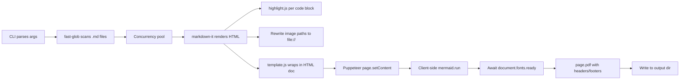

## Goal

A zero-config CLI — `md-to-pdf <dir>` — that turns every `.md` file in a directory into a polished PDF, preserving all formatting, rendering mermaid diagrams, highlighting code, and resolving local images/links.

## Stack

- **Runtime**: Node.js 18+ (CommonJS, no TS to keep it simple; easy to install globally).
- **PDF engine**: `puppeteer` (bundles Chromium, handles print CSS, headers/footers, page breaks).
- **Markdown**: `markdown-it` + an opinionated plugin bundle.
- **Diagrams**: `mermaid` (loaded client-side inside the Puppeteer page — most reliable rendering for all diagram types). Mermaid theme is set per mode: `default` (light) / `dark` (dark).
- **Code highlight**: `highlight.js` (server-side, so PDFs don't depend on network). Two themes shipped: a custom light theme on Ivory and a custom dark theme on Near Black — both warm-toned.
- **Math**: `markdown-it-katex` + KaTeX CSS.
- **CLI UX**: `commander`, `chalk`, `ora`, `fast-glob`.
- **Design system**: Claude/Anthropic-inspired — parchment canvas, warm-only neutrals, terracotta accent, serif headlines, ring-based depth.

## CLI Surface

```text
md-to-pdf <inputDir> [options]

Options:
  -o, --output <dir>        Output directory (default: ./pdf)
  -r, --recursive           Recurse into subdirectories
  -s, --single-file         Merge all .md files into one PDF (in alpha order)
  -m, --mode <mode>         light | dark                      (default: light)
                            light = Parchment canvas, dark = Near Black canvas
      --accent <hex>        Override the Terracotta brand accent (default: #c96442)
  -f, --format <fmt>        A4 | Letter | Legal               (default: A4)
      --toc                 Auto-generate a table of contents
      --cover               Generate a cover page (title, date, file list)
      --no-page-numbers     Disable footer page numbers
      --header <text>       Custom header text (supports {file}, {title})
      --footer <text>       Custom footer text
      --show-link-urls      Print external URLs after link text (for offline reading)
  -c, --concurrency <n>     Parallel conversions (default: 3)
  -w, --watch               Watch and reconvert on change
      --open                Open PDF folder when done

Interactive:
  If --mode is not supplied and stdin is a TTY, the CLI prompts:
  "Render mode?  (1) Light - Parchment  (2) Dark - Near Black"
```

## Project Structure

```text
md-to-pdf/
  package.json
  README.md
  .gitignore
  bin/md-to-pdf.js           # shebang entry, calls src/cli.js
  src/
    cli.js                   # commander setup, arg validation
    converter.js             # orchestrator: glob -> render -> pdf
    markdown.js              # markdown-it + plugins config
    template.js              # builds the final HTML doc
    pdf.js                   # puppeteer lifecycle + PDF options
    mermaid-runtime.js       # mermaid init script injected into page
    logger.js                # ora + chalk helpers
    themes/
      tokens.css             # CSS variables for light + dark (Anthropic palette)
      base.css               # typography scale, components, layout rules
      theme-light.css        # Parchment canvas bindings
      theme-dark.css         # Near Black canvas bindings
      highlight-light.css    # hljs theme tuned to Ivory card surface
      highlight-dark.css     # hljs theme tuned to Near Black surface
      katex.css              # re-exported from katex package
      print.css              # @page, page-break rules, print link behavior
    prompt.js                # minimal light/dark prompt when --mode is missing
```

## Key Design Decisions

### 1. Markdown pipeline (in `src/markdown.js`)

Configured `markdown-it` instance with:

- `html: true, linkify: true, typographer: true, breaks: false`
- Plugins: `markdown-it-anchor`, `markdown-it-toc-done-right`, `markdown-it-task-lists`, `markdown-it-footnote`, `markdown-it-emoji`, `markdown-it-container` (for `::: note/warning/tip` admonitions), `markdown-it-attrs`, `markdown-it-katex`.
- Custom `highlight` function using `highlight.js` — wraps with `<pre><code class="hljs language-xxx">`.
- Custom fence rule: `mermaid` fenced blocks emit `<div class="mermaid">…</div>` verbatim (no HTML-escape) so the client-side mermaid runtime picks them up.
- Image renderer override: rewrite relative `src` paths to absolute `file://` URIs based on the source `.md` file's directory so Puppeteer loads them.
- Link renderer override: add `target="_blank"` and a CSS class `external-link` for `http(s)` links so they can be visually highlighted.

### 2. Mermaid rendering (in `src/mermaid-runtime.js` + `template.js`)

Mermaid runs inside the Puppeteer page (NOT server-side) — this handles flowcharts, sequence, class, state, ER, gantt, pie, journey, gitGraph, mindmap uniformly. The init call is themed per `--mode` and tinted with the warm palette so diagrams don't clash with the editorial surface:

```html
<script src="file:///.../node_modules/mermaid/dist/mermaid.min.js"></script>
<script>
  mermaid.initialize({
    startOnLoad: false,
    securityLevel: 'loose',
    theme: 'base',
    themeVariables: {
      // Light mode defaults; swapped at render time for dark mode
      background: '#faf9f5',
      primaryColor: '#faf9f5',
      primaryTextColor: '#141413',
      primaryBorderColor: '#e8e6dc',
      lineColor: '#5e5d59',
      secondaryColor: '#f0eee6',
      tertiaryColor: '#e8e6dc',
      fontFamily: 'Anthropic Sans, system-ui, Arial, sans-serif'
    }
  });
  window.__mermaidDone = mermaid.run({ querySelector: '.mermaid' });
</script>
```

Dark-mode variables flip to `background:#141413`, `primaryColor:#30302e`, `primaryTextColor:#faf9f5`, `primaryBorderColor:#30302e`, `lineColor:#b0aea5`.

In `pdf.js`, before calling `page.pdf()`:

```js
await page.evaluate(async () => { await window.__mermaidDone; });
await page.evaluateHandle('document.fonts.ready');
```

This guarantees every diagram is fully rendered (as inline SVG) and fonts are loaded before the PDF is written.

### 3. HTML template (`src/template.js`)

Builds a single self-contained HTML string per document:

- Embeds `tokens.css` + `base.css` + the selected `theme-light.css`/`theme-dark.css` + matching highlight theme + KaTeX CSS + `print.css` inline.
- `<html data-mode="light|dark">` toggles the palette via CSS variables — no branching CSS elsewhere.
- `<meta charset="utf-8">`, `<title>` from first `#` heading or filename.
- Optional cover page (`<section class="cover">…</section>`) — large serif title, Terracotta hairline, date.
- Optional `<nav class="toc">` rendered from TOC plugin, styled like a magazine contents page.
- Body wrapped in `<article class="markdown-body">` for theme scoping.
- Header/footer templates for Puppeteer reuse the same tokens (filename in sans `var(--text-tertiary)`, page X of Y right-aligned).

### 4. Design system — Claude/Anthropic inspired (`src/themes/*.css`)

The entire PDF aesthetic is driven by a single token file (`tokens.css`) exposing CSS variables. `theme-light.css` and `theme-dark.css` each redefine the same variable names so the rest of the stylesheets never branch.

#### 4a. Design tokens (`tokens.css`)

```css
:root {
  /* LIGHT — Parchment canvas */
  --bg-page:        #f5f4ed;  /* Parchment */
  --bg-surface:     #faf9f5;  /* Ivory — cards */
  --bg-sand:        #e8e6dc;  /* Warm Sand — chips/code inline */
  --bg-white:       #ffffff;

  --text-primary:   #141413;  /* Near Black */
  --text-secondary: #5e5d59;  /* Olive Gray */
  --text-tertiary:  #87867f;  /* Stone Gray */
  --text-emph:      #3d3d3a;  /* Dark Warm */
  --text-button:    #4d4c48;  /* Charcoal Warm */

  --brand:          #c96442;  /* Terracotta */
  --brand-soft:     #d97757;  /* Coral */
  --error:          #b53333;
  --focus:          #3898ec;  /* only cool color, focus rings only */

  --border-soft:    #f0eee6;  /* Border Cream */
  --border-warm:    #e8e6dc;  /* Border Warm */
  --ring-warm:      #d1cfc5;
  --ring-deep:      #c2c0b6;

  --code-bg:        #faf9f5;
  --code-border:    #e8e6dc;
  --code-inline-bg: #f0eee6;

  --shadow-whisper: 0 4px 24px rgba(0,0,0,0.05);
  --shadow-ring:    0 0 0 1px var(--ring-warm);

  --font-serif: "Anthropic Serif", "Source Serif Pro", Georgia, "Times New Roman", serif;
  --font-sans:  "Anthropic Sans", "Inter", system-ui, -apple-system, Segoe UI, Arial, sans-serif;
  --font-mono:  "Anthropic Mono", "JetBrains Mono", "Fira Code", Consolas, Menlo, monospace;
}

[data-mode="dark"] {
  --bg-page:        #141413;  /* Near Black */
  --bg-surface:     #30302e;  /* Dark Surface */
  --bg-sand:        #30302e;
  --bg-white:       #30302e;

  --text-primary:   #faf9f5;  /* Ivory */
  --text-secondary: #b0aea5;  /* Warm Silver */
  --text-tertiary:  #87867f;
  --text-emph:      #faf9f5;
  --text-button:    #b0aea5;

  --brand:          #d97757;  /* Coral — links pop on dark */
  --brand-soft:     #c96442;

  --border-soft:    #30302e;
  --border-warm:    #3d3d3a;
  --ring-warm:      #3d3d3a;
  --ring-deep:      #4d4c48;

  --code-bg:        #1d1d1b;
  --code-border:    #30302e;
  --code-inline-bg: #30302e;

  --shadow-whisper: 0 4px 24px rgba(0,0,0,0.35);
  --shadow-ring:    0 0 0 1px var(--ring-warm);
}
```

#### 4b. Typography hierarchy (print-tuned, scaled 0.85x from web sizes so A4 holds density)

- **h1**: `var(--font-serif)` weight 500, 36pt, line-height 1.10, top margin 0, bottom margin 16pt, bottom border `1px solid var(--border-warm)` with 8pt padding under.
- **h2**: serif 500, 26pt, line-height 1.20, 1px bottom border.
- **h3**: serif 500, 20pt, line-height 1.20.
- **h4**: serif 500, 16pt, line-height 1.30.
- **h5/h6**: serif 500, 13pt/11pt, uppercased `overline` variant at h6 (letter-spacing 0.5px).
- **Body**: `var(--font-sans)`, 11pt, line-height 1.60 (editorial), color `var(--text-primary)`.
- **Lead paragraph** (first `<p>` after h1): `var(--font-serif)` 13pt, `var(--text-secondary)`.
- **Small/caption**: sans 9pt, `var(--text-tertiary)`.
- **Code**: `var(--font-mono)` 9.5pt, line-height 1.55, letter-spacing -0.2px.

#### 4c. Components

- **Page canvas** — `background: var(--bg-page)`; `color: var(--text-primary)`; max content width ~680px (A4 text column), centered.
- **Cover page** (when `--cover`): full-bleed Parchment/Near Black section; large serif title (48pt, weight 500, line-height 1.10), subtitle in `--text-secondary`, terracotta hairline divider, date + filename list in sans.
- **Tables**: header row on `var(--bg-sand)` with serif 500 11pt, 1px warm borders, rows zebra-striped (`var(--bg-surface)` alternating). No cool-gray anywhere.
- **Blockquotes**: 3px left bar in `var(--brand)`, 16pt left padding, serif italic body in `var(--text-secondary)`.
- **Code blocks**: rounded 12px panel, `background: var(--code-bg)`, `border: 1px solid var(--code-border)`, `box-shadow: var(--shadow-ring)`. Language chip in the top-right (overline sans 9pt on `var(--bg-sand)`, 6px radius). Line-numbers gutter in `var(--text-tertiary)`. `pre { break-inside: avoid; }`.
- **Inline code**: `background: var(--code-inline-bg)`, 4px radius, 0.1em horizontal padding.
- **Links** (all): `color: var(--brand)`, `text-decoration: underline`, `text-underline-offset: 2px`, `text-decoration-thickness: 1px`. External links (http/https) get `.external-link` + a small `↗` glyph via `::after`, and optionally the URL in parentheses in `--text-tertiary` when `--show-link-urls` is set.
- **Images/figures**: `max-width: 100%`, 16px border-radius, 1px `var(--border-warm)` border, `box-shadow: var(--shadow-whisper)`, figure caption in 9pt sans `var(--text-tertiary)`.
- **Mermaid `.mermaid` blocks**: centered inside a rounded 16px Ivory/Dark Surface container with `var(--shadow-whisper)`, 16pt vertical margin, `break-inside: avoid`.
- **Admonitions** (`:::note | tip | warning | danger`): 12px radius, 1px warm border, 3px left accent bar — `note` uses `--text-secondary`, `tip` uses muted green `#6b7a5a`, `warning` uses `--brand`, `danger` uses `--error`. Title in serif 500 12pt, body in sans.
- **Horizontal rule**: 1px warm border with 24pt vertical space, centered terracotta dot cluster in the middle for editorial flair.
- **Task lists**: custom-styled checkboxes on `var(--bg-sand)`, checked state uses `var(--brand)`.

#### 4d. Print CSS (`print.css`)

- `@page { size: A4; margin: 22mm 20mm 24mm 20mm; }`
- `pre, table, figure, .mermaid, blockquote { break-inside: avoid; }`
- `h1, h2, h3 { break-after: avoid; }`
- `a { color: var(--brand); }` — links stay highlighted in print.
- `--show-link-urls`: `a[href^="http"]::after { content: " (" attr(href) ")"; font-size: 0.8em; color: var(--text-tertiary); }`.
- Puppeteer `printBackground: true` is required for the Parchment canvas to render — otherwise Chromium strips page backgrounds.
- Orphan/widow control: `p, li { orphans: 3; widows: 3; }`.

### 5. Puppeteer runner (`src/pdf.js`)

- Launch once, reuse browser across files; one page per file.
- `page.setContent(html, { waitUntil: ['load','networkidle0'] })`.
- Await mermaid + fonts (see above).
- `page.pdf({ format, printBackground: true, preferCSSPageSize: true, displayHeaderFooter: true, margin, headerTemplate, footerTemplate })`.
- Header/footer templates include filename + `<span class="pageNumber"></span>/<span class="totalPages"></span>`.
- Concurrency via a small semaphore (default 3) over the glob result.

### 6. Single-file mode (`--single-file`)

When set, concatenate all markdown sources (sorted alphabetically, separated by `\n\n<div class="page-break"></div>\n\n`) into one HTML, producing one PDF with a cover + TOC spanning the whole set.

### 7. Error handling & logging

- Per-file try/catch; failures reported at the end with file path + error summary, exit code `1` if any failed.
- `ora` spinner per file, `chalk` for status, final summary table (files, pages written, total time).

## Dependencies (`package.json`)

```json
{
  "name": "md-to-pdf",
  "version": "0.1.0",
  "bin": { "md-to-pdf": "bin/md-to-pdf.js" },
  "dependencies": {
    "puppeteer": "latest",
    "markdown-it": "latest",
    "markdown-it-anchor": "latest",
    "markdown-it-toc-done-right": "latest",
    "markdown-it-task-lists": "latest",
    "markdown-it-footnote": "latest",
    "markdown-it-emoji": "latest",
    "markdown-it-container": "latest",
    "markdown-it-attrs": "latest",
    "@vscode/markdown-it-katex": "latest",
    "highlight.js": "latest",
    "mermaid": "latest",
    "katex": "latest",
    "commander": "latest",
    "chalk": "latest",
    "ora": "latest",
    "fast-glob": "latest",
    "chokidar": "latest",
    "prompts": "latest"
  }
}
```

Exact versions will be pinned by `npm install` (plan avoids hardcoding versions).

## Conversion Flow



## Test / Demo Assets

A `samples/` folder with one demo `.md` exercising every feature (heading hierarchy, tables, task lists, footnotes, images, mermaid flow/sequence/gantt, inline + block math, nested code fences, admonitions, external links) so the user can verify everything in both modes:

```text
md-to-pdf samples -o samples/out --toc --cover --mode light
md-to-pdf samples -o samples/out --toc --cover --mode dark
```

Both outputs should look like pages out of the same book — one printed on parchment, one printed on dark paper.

## README highlights

Install (`npm i -g .` or `npx md-to-pdf`), the full CLI reference, theme gallery screenshots placeholder, troubleshooting (Puppeteer chromium download behind a proxy, mermaid fonts), and an FAQ.
