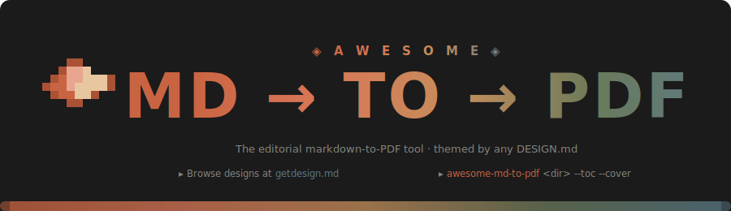

<p align="center">
  
</p>

<h1 align="center">awesome-md-to-pdf</h1>

<p align="center">
  <strong>Awesome editorial Markdown &rarr; PDF.</strong><br>
  Convert a directory of Markdown files into beautifully styled PDFs.<br>
  Ships with a Claude/Anthropic-inspired default design and a parser that lets you swap in any <code>DESIGN.md</code> from <a href="https://getdesign.md">getdesign.md</a> to theme your output on the fly.
</p>

<p align="center">
  <a href="https://<owner>.github.io/awesome-md-to-pdf"><strong>Documentation</strong></a> &nbsp;&middot;&nbsp;
  <a href="https://www.npmjs.com/package/awesome-md-to-pdf"><strong>npm</strong></a>
</p>

## Features

- **Dynamic design pipeline** — drop in any `DESIGN.md` (browse at [getdesign.md](https://getdesign.md)) and the PDF re-themes itself. The Claude baseline stays as the default so existing calls are unchanged.
- **Interactive chat mode** — run `awesome-md-to-pdf` with no args and you land in a slash-command REPL (`/help`, `/convert`, `/design`, `/mode`, ...) with a live progress bar for every conversion.
- **Fancy 3D welcome banner** — gradient ANSI Shadow `MD-TO-PDF` wordmark with a letter-spaced `A W E S O M E` eyebrow and an isometric 4-point starburst icon, all colored with 24-bit true-color.
- **Editorial base design** — warm Parchment canvas, serif headlines (weight 500), sans body at 1.60 line-height, terracotta brand accent, ring-based depth. Every gray is warm-toned.
- **Light or dark mode** — `--mode light` (Parchment canvas) or `--mode dark` (Near Black canvas). Prompted interactively when omitted.
- **Mermaid diagrams** — flowcharts, sequence, class, state, ER, gantt, pie, journey, gitGraph, mindmap — all rendered client-side with palette-matched theming that follows the active design.
- **Syntax-highlighted code** — `highlight.js` server-side, warm-toned theme, language chip, line wrapping controlled for print.
- **Rich markdown** — tables (zebra-striped), task lists, footnotes, emoji, KaTeX math, container admonitions (`:::note`, `:::tip`, `:::warning`, `:::danger`), attribute syntax, TOC, auto-anchored headings.
- **Images** — relative paths auto-resolved to `file://` so local assets just work.
- **Links** — external URLs highlighted with the brand accent and an `↗` glyph. Optional inline URL printing for offline reading.
- **Full-bleed pages** — the canvas extends to every page edge. Typographic A4 margins (22mm/20mm/24mm/20mm) live inside the content, not as white borders.
- **Page polish** — cover page, TOC page, optional running header/footer bands (opt-in), orphan/widow control, smart page breaks around code blocks, tables, figures.
- **Watch mode** — auto-rebuild on change.

## Install

```bash
# Global install (preferred)
npm install -g awesome-md-to-pdf

# Or one-off via npx
npx awesome-md-to-pdf ./docs --toc --cover --mode light
```

Either install exposes two identical binaries: `awesome-md-to-pdf` (canonical) and `md-to-pdf` (legacy alias, kept for backward compatibility).

### From source

```bash
git clone https://github.com/<owner>/awesome-md-to-pdf.git
cd awesome-md-to-pdf
npm install      # installs runtime + TypeScript toolchain
npm run build    # compiles src/*.ts -> dist/*.js and copies CSS + design assets
npm link         # optional: exposes `awesome-md-to-pdf` globally
```

Or run directly without linking:

```bash
node bin/awesome-md-to-pdf.js              # chat mode
node bin/awesome-md-to-pdf.js <inputDir>   # one-shot
```

## Two ways to use it

### 1. Chat mode (no args)

```bash
awesome-md-to-pdf
```

You'll see the 3D gradient banner (starburst + `A W E S O M E` eyebrow + `MD-TO-PDF` wordmark), then drop into the REPL:

```text
[✦ · light] ›
```

The `✦` is the awesome-md-to-pdf starburst glyph — the same shape you see rendered in 3D on the left of the welcome banner.

### Navigation

As you type, awesome-md-to-pdf helps you along:

| Key | Behavior |
|---|---|
| Type `/` | A filtered dropdown of slash commands appears docked below the prompt. |
| Keep typing | The dropdown narrows live to matching commands. |
| `Up` / `Down` | Move the selection within the dropdown. |
| `Tab` | Accept the highlighted command and keep typing its arguments. |
| `Right` or `End` | Accept the dim grey "ghost" suggestion shown after your cursor (fish-shell style). |
| `Enter` | Submit the current line. |
| `Esc` | Dismiss the dropdown and ghost hint. |
| `Ctrl+C` | Cancel the current line. |
| `Ctrl+D` | Leave the chat. |

Type `/help` for the full command table. Highlights:

| Command | Purpose |
|---|---|
| `/help` | Show the command table. |
| `/convert [path]` | Convert a file or directory. Defaults to the current input dir. |
| `/design <path>` | Load a DESIGN.md from anywhere on disk. `/design reset` reverts. `/design info` previews palette + fonts. |
| `/mode [light\|dark]` | Set the render mode. No arg toggles. |
| `/input <dir>` | Set the working input directory. |
| `/output <dir>` | Set the output directory. |
| `/toc`, `/cover`, `/pages`, `/single`, `/recursive` | Toggle pipeline flags on/off. |
| `/accent <hex>` | Override the brand accent. `/accent reset` clears. |
| `/ls` | List `.md` files in the input dir. |
| `/status` | Show current session settings. |
| `/open` | Open the output folder in your file manager. |
| `/clear` | Clear the terminal. |
| `/exit`, `/quit` | Leave the chat (Ctrl+D also works). |

Progress bars show up per file with stages (parsing → building html → loading chromium → rendering → writing pdf).

### 2. One-shot mode

```bash
awesome-md-to-pdf <inputDir> [options]
```

### Options

| Flag | Description | Default |
|------|-------------|---------|
| `-o, --output <dir>` | Output directory | `./pdf` |
| `-r, --recursive` | Recurse into subdirectories | `false` |
| `-s, --single-file` | Merge all `.md` files into one PDF | `false` |
| `-m, --mode <mode>` | `light` or `dark` | prompt |
| `--design <path>` | Path to a `DESIGN.md` file or folder | bundled Claude |
| `--accent <hex>` | Override the brand accent | design default |
| `-f, --format <fmt>` | `A4` / `Letter` / `Legal` | `A4` |
| `--toc` | Auto-generate a table of contents | `false` |
| `--cover` | Generate a cover page | `false` |
| `--page-numbers` | "page X / Y" band at the bottom (breaks full-bleed) | `false` |
| `--header <text>` | Custom top band (`{file}`, `{title}`, `{date}` tokens) | none |
| `--footer <text>` | Custom bottom band | none |
| `--show-link-urls` | Print external URLs after link text | `false` |
| `--no-banner` | Suppress the welcome banner (CI-friendly) | off |
| `-c, --concurrency <n>` | Parallel conversions | `3` |
| `-w, --watch` | Watch for changes and rebuild | `false` |
| `--open` | Open the output folder when done | `false` |

### Examples

```bash
# Chat mode
awesome-md-to-pdf

# One-shot, prompt for mode
awesome-md-to-pdf docs

# Dark mode, recursive, with TOC + cover page
awesome-md-to-pdf docs -r --toc --cover --mode dark

# Merge everything into a single report
awesome-md-to-pdf docs -s --toc --cover --mode light -o build

# Theme the PDF with Linear's design
awesome-md-to-pdf docs --design ./designs/linear.md --mode dark

# Watch mode
awesome-md-to-pdf docs --mode light -w
```

## Using designs from getdesign.md

[getdesign.md](https://getdesign.md) is an open collection of `DESIGN.md` specs for 60+ popular brands (Stripe, Linear, Vercel, WIRED, Notion, ...). To use one:

1. Open the brand page (e.g. `https://getdesign.md/linear.app/design-md`).
2. Click the **DESIGN.md** tab.
3. Copy the markdown and save it to a file, e.g. `designs/linear.md`.
4. Run:

```bash
awesome-md-to-pdf docs --design designs/linear.md --mode dark
```

Or from inside chat:

```text
/design designs/linear.md
/convert docs
```

The parser (see [src/design.ts](src/design.ts)) walks the `DESIGN.md`'s **Color Palette & Roles** section and, when present, the **Quick Color Reference** block. It extracts palette + typography and layers them over the Claude baseline, so any slot the parser can't cleanly identify falls back gracefully. Dark-mode tokens are used when the DESIGN.md mentions them explicitly; otherwise synthesized via inversion.

## Markdown features supported

- Headings with auto-anchors
- Tables (GFM)
- Task lists (`- [ ]` / `- [x]`)
- Footnotes (`[^1]`)
- Emoji shortcodes (`:sparkles:`)
- Inline and block math (`$x^2$`, `$$...$$`)
- Fenced code blocks with language
- ` ```mermaid ` diagram blocks
- Admonitions:
  ```
  ::: note
  Content here
  :::
  ```
- Attribute syntax (`{.class #id}`)
- GFM-style autolinks

## Project structure

```text
src/               TypeScript source
  cli.ts           Argument parsing + chat routing
  converter.ts     Glob, concurrency pool, per-file pipeline
  markdown.ts      markdown-it + plugins
  template.ts      HTML shell, :root CSS variable overrides
  pdf.ts           Puppeteer lifecycle
  mermaid-runtime.ts  Client-side mermaid init (design-aware)
  design.ts        DESIGN.md parser (synonyms + regex + dark synthesis)
  banner.ts        3D welcome banner (isometric starburst + AWESOME eyebrow + ANSI Shadow wordmark)
  repl.ts          Interactive chat loop + slash commands
  progress.ts      cli-progress wrapper (per-file + overall bars)
  logger.ts        ora + chalk helpers
  prompt.ts        Light/dark picker
  themes/          CSS assets (copied to dist/ during build)
  designs/         Bundled claude.md + README
  types/           Ambient .d.ts shims for untyped packages
dist/              tsc output (gitignored) -- what the bin entry loads
bin/awesome-md-to-pdf.js  Thin JS shim that requires dist/cli.js (primary)
bin/md-to-pdf.js          Legacy-alias shim (kept for backward compatibility)
scripts/           Build helpers (copy-assets, clean)
```

## Development

```bash
npm run typecheck   # tsc --noEmit
npm run build       # tsc + copy-assets (themes + designs)
npm run clean       # remove dist/
npm run rebuild     # clean + build
```

## Design system

The default (Claude baseline) produces PDFs styled after the Anthropic product aesthetic: warm parchment canvas, serif headlines at weight 500 for a literary cadence, exclusively warm-toned neutrals. Depth comes from ring shadows and whisper-soft elevations — never heavy drop shadows. Links are highlighted in terracotta. See [src/themes/tokens.css](src/themes/tokens.css) for the full palette.

When `--design` is supplied, the parsed tokens override this baseline as CSS custom properties (`:root { --brand: ...; }` / `[data-mode="dark"] { --bg-page: ...; }`). Any unparsed slot transparently inherits the Claude defaults.

## Troubleshooting

- **Puppeteer fails to download Chromium** — behind a corporate proxy, set `HTTPS_PROXY` before `npm install`, or set `PUPPETEER_SKIP_DOWNLOAD=1` and point `PUPPETEER_EXECUTABLE_PATH` at a local Chrome/Edge.
- **Mermaid diagram blank in PDF** — usually caused by a syntax error in the diagram source. Chromium's page errors are forwarded to stderr during conversion.
- **Fonts look different** — Anthropic Serif/Sans/Mono are not public. The tool falls back to Georgia / system-ui / JetBrains Mono, which are close analogues. If your `DESIGN.md` names a specific font and it isn't installed on the system, Chromium uses the cascading fallback automatically.
- **Banner looks broken / monochrome** — your terminal doesn't support 24-bit color. Pass `--no-banner` or `FORCE_COLOR=2` to fall back to 256-color approximations.
- **Progress bar overlaps console output** — the bar only activates when `--concurrency=1` (the default in chat mode). In batch one-shot runs with `--concurrency > 1`, we fall back to ora spinners.

## License

MIT
