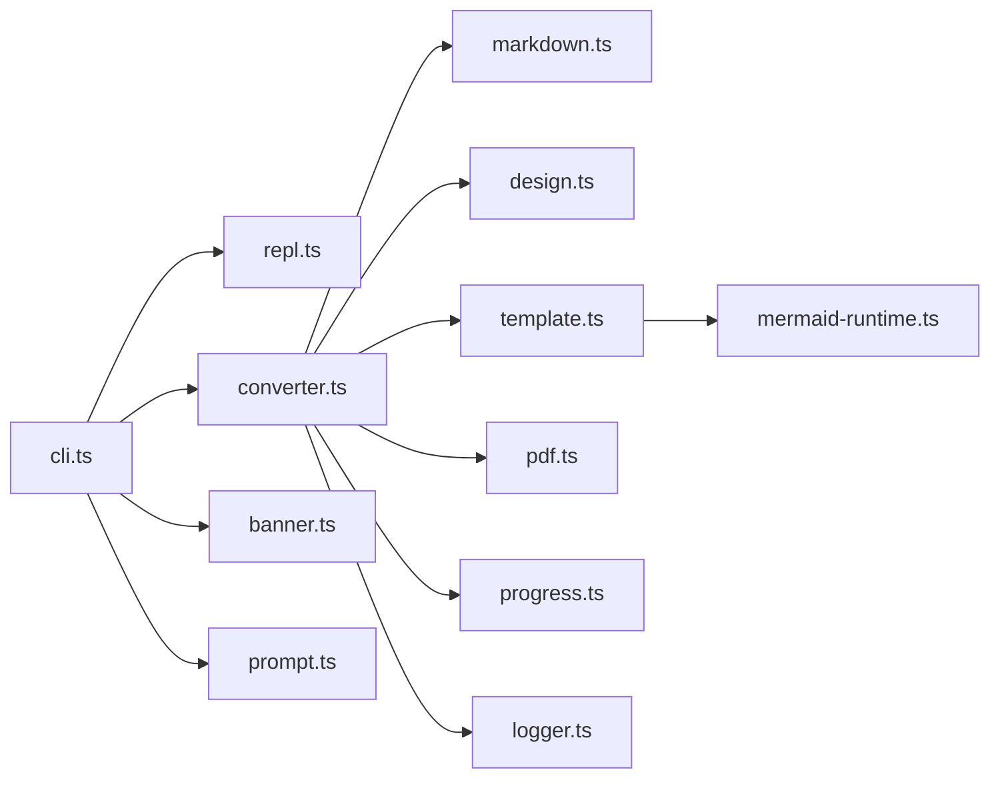
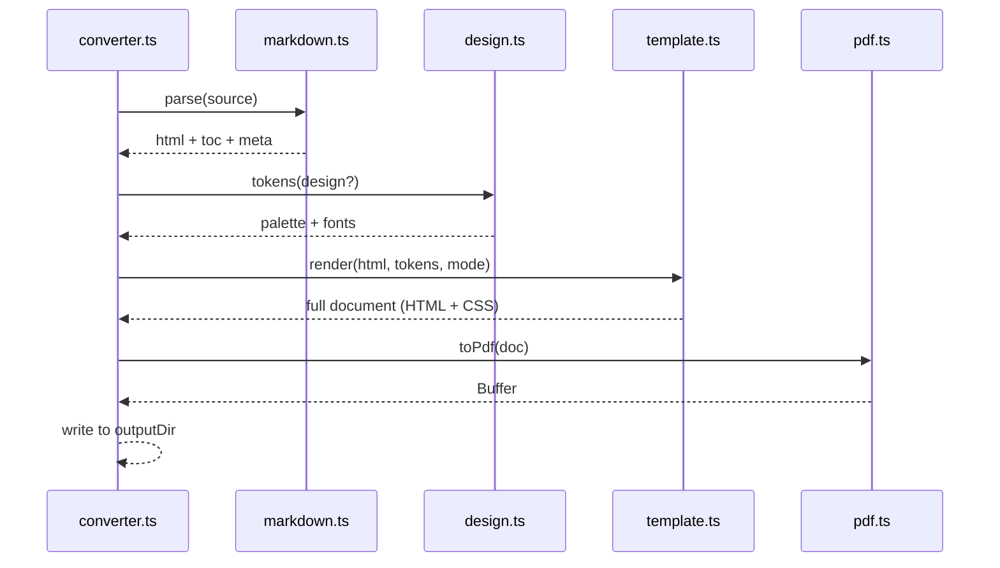
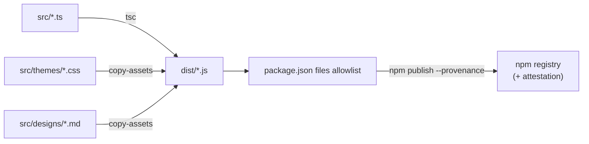

# Architecture
{: .no_toc }

awesome-md-to-pdf is a small, synchronous pipeline per file: read Markdown,
parse design tokens, render HTML, drive Chromium, write PDF. The only
concurrency is the optional per-file worker pool.
{: .fs-5 .fw-300 }

  
Table of contents

  {: .text-delta }
- TOC
{:toc}

## Module map

## Modules at a glance

| Module | Responsibility |
|---|---|
| `cli.ts` | Commander setup, flag parsing, routing to REPL or one-shot. |
| `converter.ts` | Glob inputs, worker pool, per-file orchestration. |
| `markdown.ts` | markdown-it instance + every plugin (anchor, attrs, container, emoji, footnote, task-lists, toc, katex). |
| `design.ts` | `DESIGN.md` parser. Synonyms + regex, dark-mode synthesis. |
| `template.ts` | HTML shell, embeds CSS, injects the `:root { --brand: ...; }` overrides per design. |
| `pdf.ts` | Puppeteer lifecycle -- launch, new page, `setContent`, `page.pdf(...)`, close. |
| `mermaid-runtime.ts` | Client-side mermaid init that picks up the design's palette. |
| `repl.ts` | Interactive chat loop, slash commands, ghost hints, dropdown. |
| `progress.ts` | `cli-progress` wrapper (per-file bar with stage text). |
| `banner.ts` | The 3D gradient welcome banner. |
| `prompt.ts` | `prompts`-based light/dark picker. |
| `logger.ts` | `ora` + `chalk` helpers. |
| `tty-colors.ts` | True-color / 256-color / no-color detection. |
| `themes/` | CSS -- tokens, base, print, highlight (light + dark). |
| `designs/claude.md` | Bundled default design. |

## Per-file pipeline

## Build output

- `src/**/*.ts` compiles to `dist/**/*.js` via `tsc` with source maps off.
- `scripts/copy-assets.js` copies `src/themes/*.css` and `src/designs/*.md`
  into `dist/` so the published package is self-contained.
- `bin/awesome-md-to-pdf.js` is a thin CJS shim that `require`s `dist/cli.js`.
- `bin/md-to-pdf.js` is the legacy alias shim, identical behavior.

## Build & publish flow

