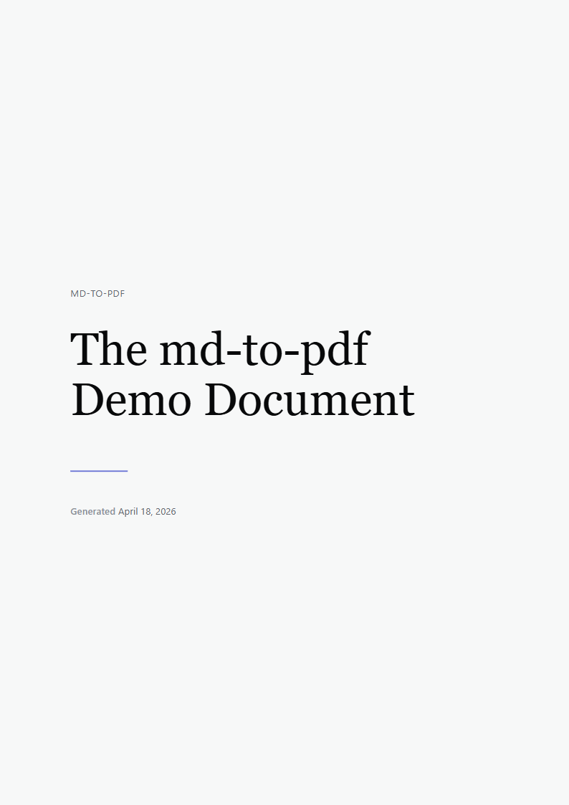

# awesome-md-to-pdf
{: .fs-9 }

Awesome editorial Markdown to PDF. Convert a directory of Markdown files
into beautifully styled PDFs with a Claude/Anthropic-inspired default design
or any `DESIGN.md` that follows Google's
[DESIGN.md spec](https://github.com/google-labs-code/design.md/blob/main/docs/spec.md).
{: .fs-6 .fw-300 }

[Get started now](./getting-started){: .btn .btn-primary .fs-5 .mb-4 .mb-md-0 .mr-2 }
[View on GitHub](https://github.com/behl1anmol/awesome-md-to-pdf){: .btn .fs-5 .mb-4 .mb-md-0 }

---

## Preview

<div style="display: grid; grid-template-columns: 1fr 1fr; gap: 1rem; margin: 1.5rem 0;">
  <figure style="margin: 0;">
    
    <figcaption style="font-size: 0.85rem; color: #87867f; margin-top: 0.4rem;">
      Linear design, light mode
    </figcaption>
  </figure>
  <figure style="margin: 0;">
    
    <figcaption style="font-size: 0.85rem; color: #87867f; margin-top: 0.4rem;">
      Linear design, dark mode
    </figcaption>
  </figure>
</div>

## Install

```bash
npm install -g awesome-md-to-pdf
```

Or run without installing:

```bash
npx awesome-md-to-pdf docs
```

## First run

```bash
# Interactive chat mode -- the 3D banner lands you in a slash-command REPL
awesome-md-to-pdf

# Or one-shot
awesome-md-to-pdf ./my-notes -o ./pdf --toc --cover --mode light
```

## Why this exists

Most Markdown-to-PDF tools produce either CMS-grade corporate output or
plain HTML-print. `awesome-md-to-pdf` aims for something rarer: editorial
typography that feels published. Warm parchment canvas, serif headlines,
ring-based depth, terracotta accents. You can swap in any spec-compliant
`DESIGN.md` and the output re-themes itself: colors, typography, rounded
corners, spacing, and component styling all flow from the file's YAML
frontmatter.

## What's inside

- **[Chat mode](./chat-mode)** -- slash commands, ghost hints, live progress bars.
- **[One-shot CLI](./one-shot-mode)** -- scriptable flags for CI pipelines.
- **[Designs](./designs)** -- spec-compliant `DESIGN.md` parsing, the token surface, and how to author your own.
- **[Themes & modes](./themes-and-modes)** -- light, dark, accent overrides.
- **[Markdown features](./markdown-features)** -- everything from Mermaid to KaTeX to task lists.
- **[Architecture](./architecture)** -- module map of the `src/` tree.
- **[Troubleshooting](./troubleshooting)** -- Puppeteer, fonts, mermaid, and banner caveats.

## License

[MIT](https://github.com/behl1anmol/awesome-md-to-pdf/blob/main/LICENSE).
