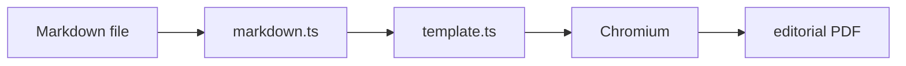

# Markdown features
{: .no_toc }

Everything `markdown-it` exposes, plus first-class support for Mermaid,
KaTeX, admonitions, and footnotes.
{: .fs-5 .fw-300 }

<details open markdown="block">
  <summary>Table of contents</summary>
  {: .text-delta }
- TOC
{:toc}
</details>

## Core syntax

| Feature | Syntax | Notes |
|---|---|---|
| Headings | `#` to `######` | Auto-anchored with `markdown-it-anchor`. |
| Tables | GFM pipe syntax | Zebra-striped, rings instead of drop shadows. |
| Task lists | `- [ ]` / `- [x]` | Rendered as boxes, not bullet points. |
| Footnotes | `Body[^1]` / `[^1]: ...` | Numbered, back-linked at the end. |
| Emoji | `:sparkles:` | Via `markdown-it-emoji`. |
| Inline math | `$x^2 + y^2 = r^2$` | KaTeX server-side. |
| Block math | `$$ ... $$` | KaTeX server-side. |
| Fenced code | ` ```ts ` | `highlight.js` + language chip. |
| Attributes | `{.class #id}` | Via `markdown-it-attrs`. |
| Autolinks | `https://example.com` | Highlighted with the brand accent. |

## Mermaid diagrams



Supported kinds: `flowchart`, `sequenceDiagram`, `classDiagram`,
`stateDiagram-v2`, `erDiagram`, `gantt`, `pie`, `journey`, `gitGraph`,
`mindmap`.

Theming follows the active design -- nodes pick up the brand, text picks
up the primary text color, and edges use the warm border tokens.

## Admonitions (container blocks)

Use `:::` containers with one of the five keywords:

```markdown
::: note
A neutral aside in warm gray.
:::

::: tip
Green -- good news, recommendations.
:::

::: warning
Amber -- "careful, this usually bites".
:::

::: danger
Crimson -- "do not do this in production".
:::

::: info
Terracotta -- cross-reference, additional context.
:::
```

## Syntax-highlighted code

- Uses `highlight.js` server-side so the PDF never depends on JS at print time.
- Language chip in the top-right of each block.
- Long lines wrap; no horizontal scrollbar in the PDF.
- Separate light + dark highlight themes chosen from the active mode.

Example:

```typescript
import { convert } from 'awesome-md-to-pdf';

await convert({
  inputDir: 'docs',
  outputDir: 'pdf',
  mode: 'light',
  toc: true,
  cover: true,
});
```

## Math

Inline: $\displaystyle e^{i\pi} + 1 = 0$

Block:

$$
\chi^2 = \sum_{i=1}^{n} \frac{(O_i - E_i)^2}{E_i}
$$

## Table of contents

Add `[[toc]]` anywhere in the document for a local TOC, or pass `--toc`
to inject an auto-generated TOC page at the front of the PDF.

## Images

Relative paths are resolved against the source Markdown file and rewritten
to `file://` URLs before Chromium loads the HTML, so ``
works without copying assets.

## Links

External URLs are underlined with the brand accent and prefixed with an
`↗` glyph. Pass `--show-link-urls` to also print the full URL after the
link text -- handy for PDFs read offline or on paper.
