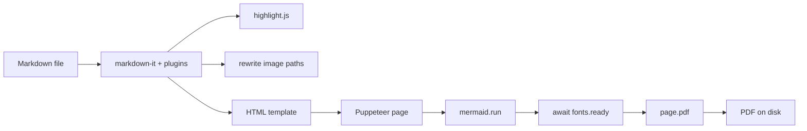
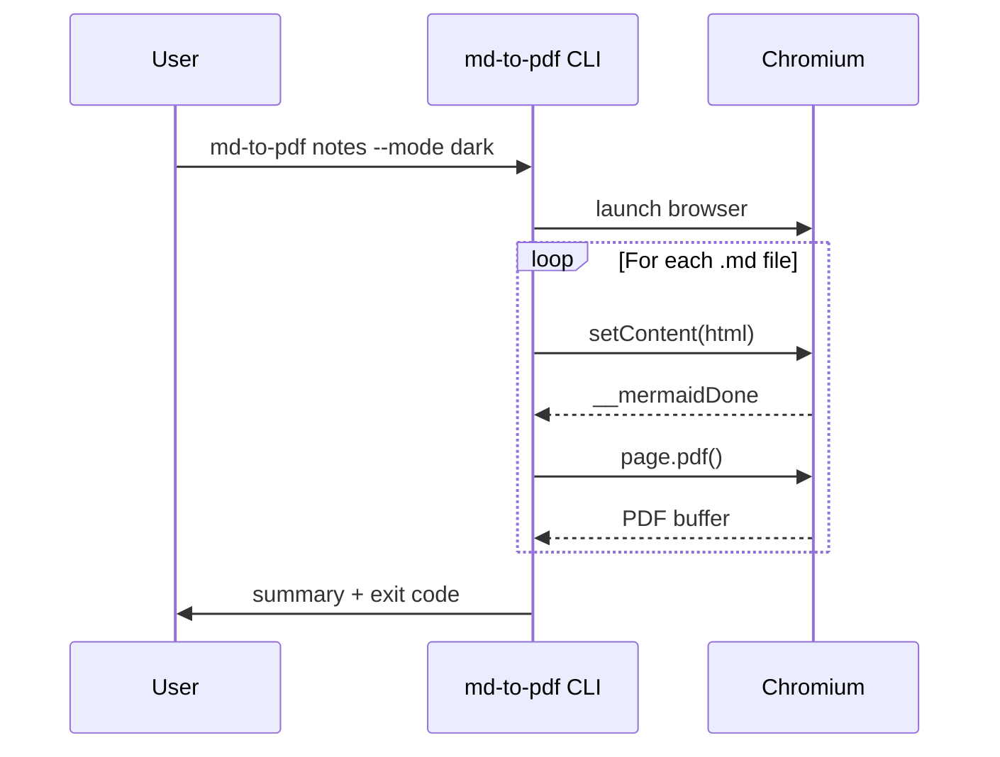
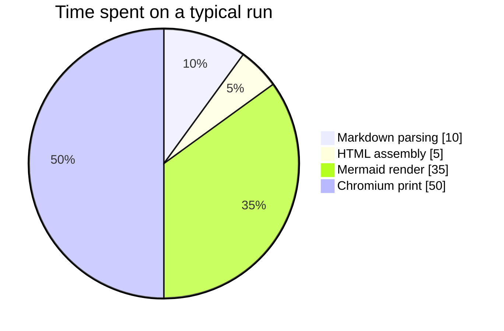

# The md-to-pdf Demo Document

A feature showcase for `md-to-pdf` -- an npm-based CLI that turns Markdown into beautifully styled PDFs. Everything you see below renders correctly in both light (Parchment) and dark (Near Black) modes.

> The design is a literary salon reimagined as a product page -- warm, unhurried, and quietly intellectual. Every gray is warm-toned. Every link glows terracotta.

---

## Typography in Action

The heading above is rendered in a serif at weight 500. Body copy is a humanist sans with a generous 1.6 line-height for an editorial reading rhythm. **Strong emphasis** and *italic* are supported, and so is ~~strikethrough~~ where the parser allows it.

A classical flourish: "curly quotes" and em-dashes -- all courtesy of the typographer extension.

## Lists

### Unordered

- Warm parchment canvas
- Exclusively warm-toned neutrals
- Terracotta brand accent
- Ring-based depth rather than heavy drop shadows

### Ordered

1. Parse markdown with `markdown-it` + plugins
2. Highlight code server-side via `highlight.js`
3. Render mermaid diagrams client-side in Chromium
4. Print to PDF via Puppeteer

### Task list

- [x] Scaffold the project
- [x] Wire up the Anthropic design tokens
- [x] Render mermaid and code blocks
- [ ] Add your own markdown files and rerun!

---

## Links and References

Visit [the Anthropic website](https://www.anthropic.com) or read the [markdown-it docs](https://markdown-it.github.io). Inline links use the brand color and pick up a small arrow glyph so readers know they lead somewhere external. Relative links like [the README](./README.md) keep their styling but skip the arrow.

## Code

Inline code: use `npm install` to pull dependencies, then `node bin/md-to-pdf.js samples`.

A full block with syntax highlighting:

```js
const fs = require('fs');
const { createMarkdown } = require('./markdown');

async function renderFile(filePath) {
  const source = await fs.promises.readFile(filePath, 'utf8');
  const md = createMarkdown({ sourcePath: filePath });
  return md.render(source);
}

renderFile('README.md').then((html) => {
  console.log(`Rendered ${html.length} chars of HTML.`);
});
```

A Python snippet:

```python
from dataclasses import dataclass

@dataclass
class Document:
    title: str
    pages: int

    def summary(self) -> str:
        return f"{self.title} ({self.pages} pages)"

doc = Document("The Parchment Manual", 42)
print(doc.summary())
```

A shell session:

```bash
# Convert a folder of notes into a collected PDF
md-to-pdf notes \
  --recursive \
  --single-file \
  --toc --cover \
  --mode dark \
  --output build
```

---

## Tables

| Token          | Light value | Dark value  | Role                            |
|----------------|-------------|-------------|---------------------------------|
| `--bg-page`    | `#f5f4ed`   | `#141413`   | Page canvas                     |
| `--bg-surface` | `#faf9f5`   | `#30302e`   | Cards / code blocks             |
| `--text-primary` | `#141413` | `#faf9f5`   | Body text                       |
| `--brand`      | `#c96442`   | `#d97757`   | Links, bars, terracotta accents |
| `--border-warm`| `#e8e6dc`   | `#3d3d3a`   | Dividers, rows                  |

## Quotations

> "Good typography is invisible. Bad typography is everywhere."
>
> -- a paraphrase that pairs well with a parchment canvas

## Admonitions

::: note
This is a gentle aside. Use it for context that's nice to have but not essential.
:::

::: tip Pro Tip
Pass `--single-file` to merge a whole directory into a single PDF with a cover page and unified table of contents.
:::

::: warning Watch Out
Chromium strips page backgrounds by default -- `md-to-pdf` enables `printBackground: true` so the Parchment canvas survives the print.
:::

::: danger Be Careful
Don't mix cool blue-grays into the palette. The design system is exclusively warm-toned by intent.
:::

---

## Diagrams

### Flowchart



### Sequence



### Pie



---

## Math

Inline math: the Pythagorean relation is $a^2 + b^2 = c^2$.

Block math -- the quadratic formula:

$$x = \frac{-b \pm \sqrt{b^2 - 4ac}}{2a}$$

And an integral:

$$\int_0^\infty e^{-x^2}\,dx = \frac{\sqrt{\pi}}{2}$$

---

## Footnotes

Links, quotes, and asides often deserve a footnote.[^1] Multiple footnotes compound neatly.[^design]

[^1]: Footnotes render at the bottom of the document in a quieter text size.
[^design]: The design draws from Anthropic's Claude product pages: warm palette, serif headlines, ring-based depth.

---

## Emoji

A few inline shortcodes: :sparkles: :rocket: :books: :coffee: :art:

---

## Epilogue

If you can see everything above rendered with consistent warm neutrals, serif headlines, highlighted code, and three working mermaid diagrams, you're looking at a successful conversion. Pair it with `--cover` and `--toc` for the full magazine treatment.
